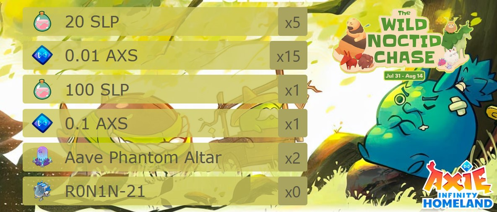

Tiny utility to collect and summarize [Ronin](https://roninchain.com/) EVM blockchain wallet's transactions, related to "Noctid Hunting" event that took place between Jul 31 and Aug 14 in 2024. To check Ronin Block Explorer please refer to [this](https://app.roninchain.com/) page. I'm not owner of [images](./src/assets/images/) used in the project. Those belong to [Skymavis](https://skymavis.com/).

Example output:



<br/>

Data research:

```json
// transaction object example
{
    "transactionHash": "0x8d20d14a6d....",
    "blockHash": "0xbb38bf3f714a9...",
    "blockNumber": 3734...,
    "gas": 541843,
    "gasPrice": "0x4a817c800",
    "effectiveGasPrice": "0x4a817c800",
    "gasUsed": 353294,
    "cumulativeGasUsed": 12536084,
    "input": "0x5ac665560000000...",
    "nonce": 1091,
    "value": "0x5ff319..",
    "blockTime": 1723878418
}
```

- when `input` starts with `0x5ac66556`, transaction is related to "claimGift" action
- use `transactionHash` to fetch transaction details
- `blockTime` is timestamp when transaction was signed

```json
// transaction details object example
{
  "blockNumber": 37186933,
  "tokenId": "690773204849...",
  "contractAddress": "0xa96660f0e...",
  "tokenStandard": "ERC721",
  "tokenName": "Axie Land Item",
  "tokenSymbol": "ITEM",
  "from": "0xc1f6...",
  "to": "0x15be...",
  "value": "1",
  "blockHash": "0x4128...",
  "transactionHash": "0x8a5...",
  "blockTime": 1723395791
}
```

- considered `tokenSymbol` values: `ITEM` (NFT), `SLP` and `AXS`
- `tokenId` is only available when transaction refers to NFT item
- when `tokenId` starts with
  - `69077320484950508083...` = Altar item NFT
  - `71119014686476138863...` = R0N1N item NFT
